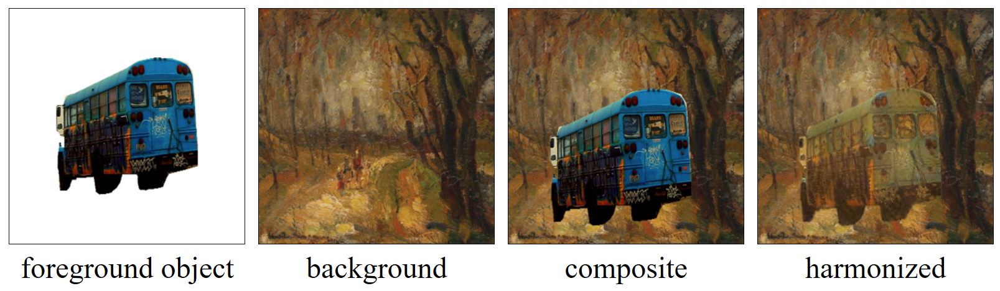
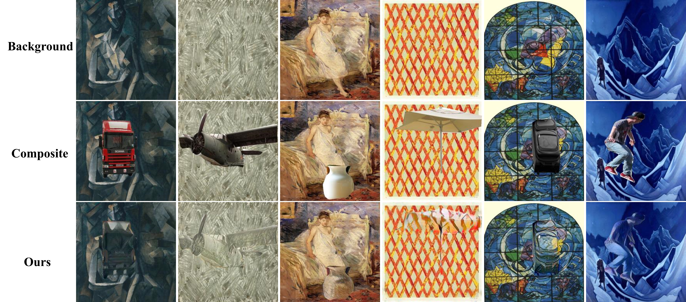

# PHDNet: Painterly Image Harmonization in Dual Domains

This is the official repository for the following paper:

> **Painterly Image Harmonization in Dual Domains**  [[arXiv]](http://arxiv.org/abs/2212.08846)<br>
>
> Junyan Cao, Yan Hong, Li Niu<br>
> Accepted by **AAAI 2023**.


**Part of our PHDNet has been integrated into our image composition toolbox libcom https://github.com/bcmi/libcom. Welcome to visit and try ＼(^▽^)／** 

**Painterly image harmonization** aims to adjust the foreground style of the painterly composite image to make it compatible with the background. A painterly composite image contains a photographic foreground object and a painterly background image.


<p align='center'>  
  
</p>

**Our PHDNet is the first feed-forward painterly image harmonization method with released code.**

When the background has dense textures or abstract style, our [PHDiffusion](https://github.com/bcmi/PHDiffusion-Painterly-Image-Harmonization) can achieve better performance.

Sometimes setting the background style as the target style is not reasonable, this problem has been solved in our [ArtoPIH](https://github.com/bcmi/ArtoPIH-Painterly-Image-Harmonization). 

## Datesets
Paniterly image harmonization requires two types of images: photographic image and painterly image. We cut a certain object from a photographic image by the corresponding instance mask, and then paste it onto a painterly image, generating a composite image. 
### Photographic image
We apply images from [COCO](https://arxiv.org/pdf/1405.0312.pdf) to produce the foreground objects. For each image, We select the object with foreground ratio in [0.05, 0.3] and generate the forefround mask. The selected foreground masks are provided in [Baidu Cloud](https://pan.baidu.com/s/1x4BIPtOP02I8rcpNUZeSKA) (access code: ww1t) or [OneDrive](https://1drv.ms/u/s!AohNSvvkuxZmgRxR_tq8JAEHvmhY?e=K2llX8). The training set can be downloaded from [COCO_train](http://images.cocodataset.org/zips/train2014.zip) (alternative: [Baidu Cloud](https://pan.baidu.com/s/19d5BsbcVwIH4jMXGLpcBtg) (access code: nfsh), [OneDrive](https://1drv.ms/u/s!AohNSvvkuxZmgR6uQZPVYOUKLkW-?e=31IEi0)) and the test set from [COCO_test](http://images.cocodataset.org/zips/val2014.zip) (alternative: [Baidu Cloud](https://pan.baidu.com/s/1bOZzpoyO3aNPR3NSqAVXkw) (access code: nsvj), [OneDrive](https://1drv.ms/u/s!AohNSvvkuxZmgR2IfB9gGPZ3FOZN?e=WqPXkS)).
### Painterly image
We apply images from [WikiArt](https://www.wikiart.org/) to be the backgrounds. The dataset can be downloaded from [Baidu Cloud](https://pan.baidu.com/s/192pGtJeMzj5VqTDjH6DUXg) (access code: sc0c) or [OneDrive](https://1drv.ms/f/s!AohNSvvkuxZmgSZEBEr6TWVbD5jz?e=YBIplJ). The training/test data list are provided in [wikiart_split](https://github.com/cs-chan/ArtGAN/tree/master/WikiArt%20Dataset/Style) or [OneDrive](https://1drv.ms/f/s!AohNSvvkuxZmgRYdBB84vH8XXPL0?e=XiIYRH).

The example dataset dirs:
```
your_dir
│
└───MS-COCO
│   └───SegmentationClass_select
│   │   │   XXX.png
│   │   │  ...
│   │   
│   └───train2014
│   │   │   XXX.jpg
│   │   │  ...
│   │   
│   └───val2014
│       │   XXX.jpg
│       │  ...
│   
└───wikiart
    └───WikiArt_Split
    │   │   style_class.txt
    │   │   style_train.csv
    │   │   style_val.csv
    │       
    └───unzipped_subfolders
```

## Prerequisites
- Linux
- Python 3
- PyTorch 1.10
- NVIDIA GPU + CUDA

## Getting Started
### Installation
- Clone this repo:

```bash
git clone https://github.com/bcmi/PHDNet-Painterly-Image-Harmonization.git
# cd to this repo's root dir
```

- Prepare the datasets.

- Install PyTorch and dependencies from http://pytorch.org.

- Install python requirements:

```bash
pip install -r requirements.txt
```

- Download pre-trained VGG19 from [Baidu Cloud](https://pan.baidu.com/s/1HljOE-4Q2yUeeWmteu0nNA) (access code: pc9y) or [OneDrive](https://1drv.ms/u/s!AohNSvvkuxZmgRoCqHs226QuvsNh?e=t4iRVD).

### PHDNet train/test
- Train PHDNet: 

```bash
cd PHDNet/scripts
bash train_phd.sh
```

The trained model would be saved under `./<checkpoints_dir>/<name>/`.

If you want to load a model then continue to train it, add `--continue_train` and set the `--epoch XX` in `train_phd.sh`. It would load the model `./<checkpoints_dir>/<name>/<epoch>_net_G.pth`.
For example, if the model is saved in `./AA/BB/latest_net_G.pth`, the `checkpoints_dir` should be `../AA/` and the `name` should be `BB`. And the `epoch` should be `latest`.

Remember to modify the `content_dir` and `style_dir` to the corresponding path of each dataset in `train_phd.sh`.

- Test PHDNet:

```bash
cd PHDNet/scripts
bash test_phd.sh
```

It would load the model `./<checkpoints_dir>/<name>/<epoch>_net_G.pth` then save the visualization under `./<checkpoints_dir>/<name>/web/TestImages/`

Our pre-trained model is available on [Baidu Cloud](https://pan.baidu.com/s/1D6iAS6Sli1QggLp-E9EvyQ) (access code: po7q) or [OneDrive](https://1drv.ms/u/s!AohNSvvkuxZmgRuRFDiH6tKZTxpI?e=DpTO2a).

- Note: `<...>` means modifiable parameters.


### Experimental results

Our method is especially good at handling the background paintings with periodic textures and patterns, because we leverage the information from both spatial domain and frequency domain. 

<p align='center'>  
  
</p>

## Other Resources
- [Awesome-Image-Harmonization](https://github.com/bcmi/Awesome-Image-Harmonization)
- [Awesome-Image-Composition](https://github.com/bcmi/Awesome-Object-Insertion)
